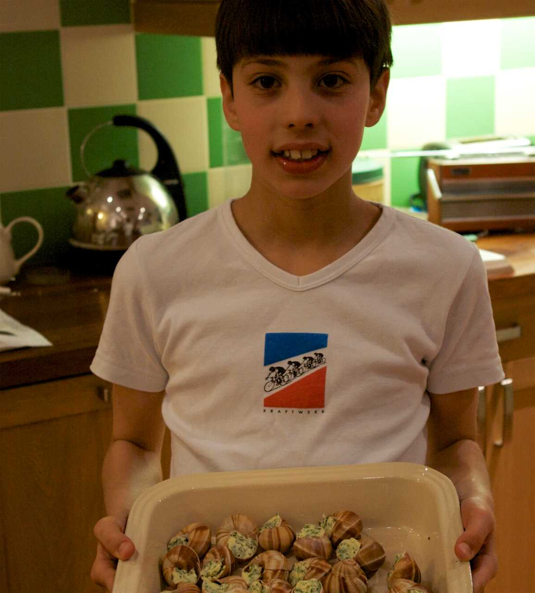

# 教程（Tutorials）

教程（tutorial）是在导师的指导下进行的**体验**。教程始终**以学习为导向**。

---

教程是一项实践活动，学生通过做一些有意义的事情来学习，以实现一些可实现的目标。

教程服务于用户获取技能和知识——他们的学习。其目的不是帮助用户完成某件事，而是帮助他们学习。

换句话说，教程就是一堂课。

重要的是要明白，虽然学生会通过实践来学习，但学生所做的不一定是他们学到的。通过实践，他们将获得理论知识（即事实）、理解和熟练。他们将学习事物如何相互关联和相互作用，以及如何与它们相互作用。他们将学习事物的名称、工具的使用、工作流程、概念、命令……等等。

## 教程作为一堂课

一堂课涉及老师和学生之间的关系。在所有此类学习中，学习都是在学生在教师的指导下致力于完成任务时进行的。

一节课就是一次学习经历。在学习经历中，重要的是学习者做了什么以及发生了什么。相比之下，老师对事实的解释和背诵就显得不那么重要了。

好的课程可以向学习者证明他们可以在某种技能或某种产品上取得成功，从而给他们带来信心。

### 教师的义务

> 当老师并不容易。

课程是老师和学生之间的一种合同，其中几乎所有的责任都落在老师身上。教师对学生要学习什么、学生将做什么来学习以及学生的成功负责。同时，学生在本合同中的唯一责任是集中注意力并尽可能严格遵循老师的指示。学生没有责任学习、理解或记忆。

同时，您让学生进行的练习必须是：

* 有意义的 —— 学生需要有成就感

* 成功的 —— 学生需要能够完成它

* 合乎逻辑的 —— 学生所经历的路径需要有意义

* 有效地完成 —— 学生必须接触到他们需要熟悉的所有动作、概念和工具

### 教程的问题

一般来说，教程很少能做好，部分原因是它们确实很难做好，部分原因是它们没有被很好地理解。在软件方面，很多产品缺乏好的教程，或者完全没有教程；教程通常与操作指南混为一谈。

在理想的课程中，教师在场并与学生互动并做出回应，纠正他们的错误并检查他们的学习情况。在文档中，这一切都是不可能的。

> 编写和维护教程可能会消耗大量的精力和时间。

整合满足上述所有标准的学习体验已经够困难的了，在许多情况下，产品本身发展迅速，这意味着所有工作都需要重新完成，以确保教程仍能发挥其功能。

您还会经常发现文档的其他部分不会像教程那样进行修订。在文档的其他地方，更改和改进通常可以单独进行；在教程中，端到端的学习过程必须有意义，它们通常会贯穿整个故事。

最后，教程包含要学习的内容和要完成的内容之间的区别的额外复杂性。教程的创建者不仅必须清楚地了解用户必须学习什么以及何时学习，他们还必须设计一个有意义的学习旅程来以某种方式提供所有这些内容。

## 主要原则

教程是一个关于教学法（pedagogical）的问题。

这不是一个简单的问题，但也不是一个谜。下面概述的原则——重复、行动、小步骤、尽早且经常产生结果、具体性等等——并不是秘密，但它们并不总是被很好地理解。

尽管如此，仍然有一些简单有效的方法可以解决实践中的教育学问题。

> * 反教学法（anti-pedagogical）的诱惑
>   * 抽象、概括
>   * 解释
>   * 选择
>   * 信息

教学的第一条规则很简单：**不要试图教学**。作为一名教师，您的工作是为学习者提供一种让他们能够学习的体验。老师不可避免地会感到一种传授知识和理解的焦虑，但如果你屈服于这种焦虑并试图通过讲述和解释来教学，你就会危及学习体验。

相反，让学习发生，并相信它会发生。给你的学习者一些事情做，他们可以通过这些事情来学习。只有你的学生才能学习。可悲的是，无论您多么渴望，您都无法为您的学生学习。你无法让他们学习，你所能做的就是让他们能够学习。

### 向学习者展示他们将要去哪里

重要的是让学习者从一开始就形成他们将取得什么成果的想法。除了帮助学习者设定一个期望之外，它还让他们在工作中看到自己正在朝着目标前进。

在教程中提供学习者所需的情境就像在一开始就告知他们一样简单：在本教程中，我们将创建并部署一个可扩展的 Web 应用程序。在此过程中，我们将使用容器化工具和服务。

这与说：在本教程中您将学习......不同，这是自以为是且非常糟糕的模式。

### 尽早并经常向学习者展示一个可见的结果

你的学习者可能正在做他们不能完全理解的新奇的事情。理解来自于能够将因果联系起来，所以应该让他们看到结果并快速、反复地建立联系。这些结果中的每一个都应该是用户认为有意义的东西。

学习者遵循的每一步都应该产生可理解的结果，无论结果多么小。

### 持续描述期望的结果

在教程的每一步中，用户都会经历一段焦虑的时刻：此操作会产生正确的结果吗？成功教程的一部分工作就在于不断向学习者提供反馈，表明他们确实走在正确的道路上。

所以需要持续描述期望的结果：“你会注意到……”；“过了一会儿，服务器响应……”。向用户展示实际的示例结果，甚至是确切的预期结果。

如果您事先知道可能出现错误的迹象是什么，请考虑标记它们：“如果输出没有显示……，您可能忘记了……”。

让用户为可能令人惊讶的操作做好准备是很有帮助的：“该命令可能会在您的终端中返回数百行日志。”

### 指出学习者应该注意的事项

学习需要反思。这种情况发生在多个层面和深度，但首先出现在学习者观察环境中的迹象时。在课程中，学习者通常过于专注于他们正在做的事情而没有注意到这些迹象，除非有老师的提示。

作为老师，你的工作就是随着课程的进行不时指出一些事情来关闭学习的循环。这可以像指出命令行提示符如何变化一样简单。

观察是一门手艺的主动部分，而不仅仅是被动的部分。这意味着关注环境，这本身就是一种技能。它经常被忽视。

### 以充实感为目标

在所有技能或工艺中，有成就的实践者都会体验到一种充实感（a feeling of doing），一种综合了目的、行动、思考和结果的过程。

随着技能的发展，它会以自信的节奏流动，并成为一种乐趣。例如，这是行走的乐趣。

> 在工作中注意自己的感受。执行特定操作是什么样的？

你的学习者的技能取决于他们能否发现这种感觉，并将其变成一种乐趣。

作为教程的创建者，您面临的挑战是确保其任务将目的和行动联系在一起，以便它们成为这种感觉的摇篮。

### 鼓励并允许重复

学习者会返回并重复给他们带来成功的练习，并在获得预期结果时获得快乐。这样做可以向他们重申，他们可以做到，而且这是有效的。

重复是建立充实感的关键，拥有这种感觉是学习的基础。

> 重复不是最好的老师 —— 有时它是唯一的老师。

在您的教程中，尝试使特定步骤和结果能够重复。这可能很困难，例如在不可逆的操作中（很难返回到上一步）—— 但请尽可能追求它。观察用户遵循教程，您可能经常会惊讶地发现他们选择重复某个步骤的频率。他们这样做只是为了看到同样的事情真的再次发生。

### 毫不留情地减少解释

教程（tutorial）不是解释（explanation）的地方。在教程中，用户专注于正确遵循您的指示并获得预期结果。稍后，当他们准备好时，他们会寻求解释，但现在他们关心的是行动。解释会分散他们的注意力，并阻碍他们的学习。

例如，这样说就足够了：我们使用 HTTPS 因为它更安全。有一个地方可以对 HTTPS 进行扩展讨论和解释，但现在不行。相反，提供该解释的链接或参考，以便它可用，但不会妨碍。

> 解释仅在用户需要时才有意义，这不是由文档作者决定的。

解释是教师最难以抗拒的诱惑之一。即使是经验丰富的教师也很难接受学生的学习不依赖于解释。这是非常自然的。一旦我们掌握了某些东西，我们就会依靠抽象的力量将其框定在自己的脑海中 —— 而我们也希望为别人这么做。理解意味着掌握一般思想，抽象是理解的逻辑形式——但这不是我们在教程中需要的，也不是成功的学习或教学的运作方式。

当老师善意的解释打破了学习的魔咒时，我们就会亲眼目睹学生的集中注意力消失在空气中。

### 专注于具体

在学习情境中，你的学生处于当下，一个由具体事物组成的时刻。您负责建立和维持学生从一项具体行动和结果到另一项具体行动和结果的流程。

专注于这个问题、这个行动、这个结果，以引导学习者一步步走向具体步骤的方式。

表面上来看通过保持对具体和特殊情况的关注，你就剥夺了学生看到或掌握更大的一般模式的机会，但事实恰恰相反。我们的大脑做得非常出色的一件事就是从具体例子中感知一般模式。所有的学习都朝着一个方向进行：从具体和特殊，到一般和抽象。后者将从前者中产生。

### 忽略选项和替代方案

您的工作是引导学习者取得成功，学习之旅上可能会有许多有趣的岔路（您正在使用的命令的不同选项、使用 API 的不同方式、实现您所描述的任务的不同方法） —— 忽略它们！你的指导需要继续关注达成结论所需的内容，其他一切都可以留到下次再做。

这样做有助于使您的教程更短、更清晰，并且使您和读者都不必做额外的认知工作。

### 追求完美的可靠性

上述所有内容都是教育学的一般原则，但教程的创建者有一个特殊的负担。

教程必须激发信心。信心只能一层层建立起来，而且很容易动摇。在每个阶段，当你要求你的学生做某事时，他们必须看到你承诺的结果。如果学习者遵循你的指导但没有得到预期的结果，他们很快就会对教程、导师和自己失去信心。

> 您必须出席，万万不可缺席。

当学生遇到麻烦时，与学生在一起的老师可以拯救他们，但在教程中你做不到。你的教程应该设计得很好，不会出错，并且你的教程在任何时候都能对任何用户起作用。

创建可靠的体验是一项艰苦的工作，但这正是您在创建教程时必须追求的目标。

无论你写得多么仔细，你的教程都会有缺陷和差距。您不会自己发现它们，您必须依靠用户为您发现它们。了解它们的唯一方法是通过广泛的测试和观察来了解用户使用教程时实际发生的情况。

## 教程的用语

1. 我们……
    * 第一人称复数肯定了导师和学习者之间的关系：你并不孤单；你并不孤独。我们一起学习。
2. 在本教程中，我们将...
    * 描述学习者将完成什么。
3. 首先，做 x。现在，做 y。现在你已经完成了 y，再做 z。
    * 没有任何含糊或怀疑的余地。
4. 我们必须始终在执行 y 之前执行 x，因为……（更多详细信息请参阅解释）。
    * 用尽可能简单的语言对操作进行最少的解释，并给出包含更详细的解释的链接。
5. 输出应该类似于……
    * 给你的学习者明确的期望。
6. 请注意……请记住……让我们检查一下……
    * 为您的学习者提供充足的线索，以帮助确认他们处于正确的轨道上并确定自己的方向。
7. 您已经构建了一个安全的三层水态停滞引擎……
    * 以温和的、钦佩的语气描述你的学习者所取得的成就。

## 以食品和烹饪为例

有过教孩子做饭经验的人会明白教程中什么是重要的，同样重要的是，什么是最不重要的。

孩子做了什么，或者做得有多正确，其实并不重要。课程的价值在于孩子获得什么，而不是他们产出什么。

与孩子一起上烹饪课的成功并不在于烹饪结果，也不在于孩子现在是否可以自己重复这个过程。成功是指孩子获得了您希望传授的知识和技能。

一个至关重要的条件是，孩子会在和你一起在厨房的经历中发现乐趣，并想要回到厨房。学习一门技能从来都不是一劳永逸的事情，重复总是需要的。

与此同时，烹饪课的框架可能是学习如何准备特定菜肴，但我们真正要孩子学习的可能是：在处理食物之前要洗手、如何握刀、为什么油必须是热的、这个器具叫什么、如何计时和测量事物。

孩子通过在厨房和你一起工作来学习这一切：在它自己的时间里、按照自己的节奏、通过你们一起做的活动，而不是通过你们所说或展示的事情。

对于年幼的孩子，你经常会发现课程在你完成你打算做的事情之前突然就结束了。这是正常现象，也是意料之中的；孩子们的注意力持续时间很短。但是，只要孩子成功地取得了一些成就（无论多么小）并且喜欢这样做，那么他就已经在技术专长的构建方面打下了一定的基础，下次还可以再接再厉。
