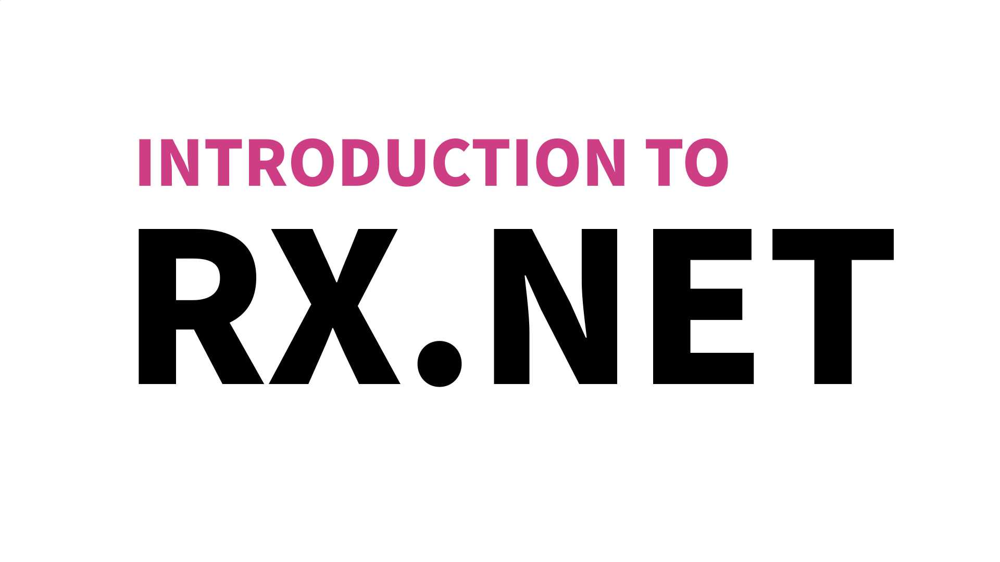

# Hugo.Trans

Hugo.Trans 包括一些由 Hugo HU 独立或合作翻译的技术文本。

## 文档写作指南

### [Diátaxis 🔗](./Diátaxis)

Diátaxis 是一个关于如何编写文档的文档，适合想要构造项目文档却不知道如何组织文档结构的文档编写者。

## .NET 中的响应式编程

关于 Rx.NET 和 ReactiveUI 的区别详见[这个回答](https://stackoverflow.com/questions/34727584/reactiveui-rxui-vs-reactive-extensions)。总而言之，Rx.NET 是一个响应式编程模型的 .NET 实现，它与 UI 无关，可以在任何类型的 .NET 程序中使用； ReactiveUI 是一个使用响应式编程模型的 MVVM 框架，主要面向使用 .NET 系 GUI 技术（WPF, Avalonia, MAUI, WinUI, Uno, Xamarin, Blazor 等等）开发的应用。

### [Introduction to Rx.NET 🔗](./Intro%20to%20Rx.NET)

### [ReactiveUI Documentation 🔗](./ReactiveUI%20Doc)

其他 ReactiveX 资源：

* [ReactiveX / RxJava 文档中文版 🔗](https://mcxiaoke.gitbooks.io/rxdocs/content/)
* [Rx.Net & ReactiveUI CheatSheet 🔗](https://github.com/cabauman/Rx.Net-ReactiveUI-CheatShee)
* [Rx.NET 响应式编程指北 🔗](https://kyocius.github.io/tags/rx.net-tutorial/)
