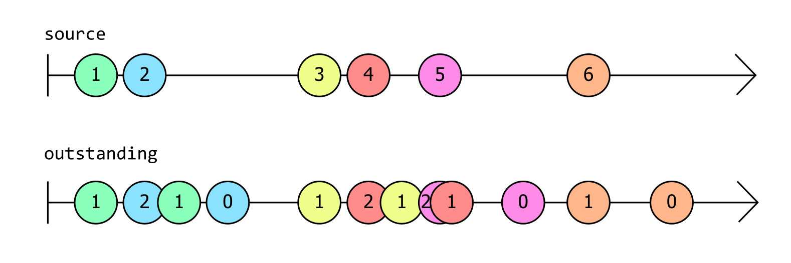

# 1.2 关键类型

Rx 功能强大，可以极大地简化响应事件的代码。但要写好响应式代码，你必须了解一些基本概念。 Rx 的基本构建块是一个名为 `IObservable<T>` 的接口，与其相对应的是名为 `IObserver<T>` 的接口。理解这两个接口是成功使用 Rx 的关键。

前面的章节将这个 LINQ 查询表达式作为第一个示例展示给读者：

```C#
var bigTrades =
    from trade in trades
    where trade.Volume > 1_000_000;
```

大多数 .NET 开发人员至少会熟悉 [LINQ](https://learn.microsoft.com/en-us/dotnet/csharp/linq/) 的多种流行形式之一，例如 [LINQ to Objects](https://learn.microsoft.com/en-us/dotnet/csharp/programming-guide/concepts/linq/linq-to-objects) 或 [Entity Framework Core 查询](https://learn.microsoft.com/en-us/ef/core/querying/)。大多数 LINQ 实现允许你查询静态数据。LINQ to Objects 适用于数组或其他集合，Entity Framework Core 中的 LINQ 查询针对数据库中的数据，但 Rx 不同：它提供了查询实时事件流（你可能称之为动态数据）的能力。

如果你不喜欢查询表达式语法，也可以直接调用 LINQ 运算符来编写完全相同的代码：

```C#
var bigTrades = trades.Where(trade => trade.Volume > 1_000_000);
```

它们都是 LINQ 的表达方式，表示我们希望 bigTrades 仅包含 trades 中 Volume 属性大于一百万的项。

我们无法准确说明这些示例的作用，因为我们看不到 trades 或 bigTrades 变量的类型。类型不同，代码的含义也会有很大差异。如果我们使用 LINQ to objects，这两个变量的类型可能是 `IEnumerable<Trade>` 。也就是说这两个变量都引用了表示集合的对象，而我们可以使用 `foreach` 循环枚举其内容；同时它们表示静态数据，即我们的代码可以直接检查的数据。

所以我们需要通过明确类型来明确代码的含义：

```C#
IObservable<Trade> bigTrades = trades.Where(trade => trade.Volume > 1_000_000);
```

这样就消除了歧义。现在很明显，我们处理的不是静态数据。我们正在使用 `IObservable<Trade>` 。但这到底是个啥？

## IObservable<T>

[`IObservable<T>`](https://learn.microsoft.com/en-us/dotnet/api/system.iobservable-1) 接口代表了 Rx 的基本抽象：若干 T 类型的值组成的序列。从非常抽象的意义上来说，这意味着它和 `IEnumerable<T>` 代表着相同的东西。

区别在于代码如何使用这些值。 `IEnumerable<T>` 使代码能够（主动地）检索值（通常使用 `foreach` 循环），而 `IObservable<T>` 在值可用时提供值。这种区别有时被描述为“推送式（push）”与“拉取式（pull）”。我们可以通过执行 `foreach` 循环从 `IEnumerable<T>` 中提取值，但 `IObservable<T>` 会将值推送到我们的代码中。

`IObservable<T>` 如何将值推送到我们的代码中？如果我们想要这些值，我们的代码必须订阅 `IObservable<T>` ，也就是说为其提供一些可以调用的方法。事实上，“订阅（Subscribe）”是 `IObservable<T>` 直接支持的唯一操作。这是接口的完整定义：

```C#
public interface IObservable<out T>
{
    IDisposable Subscribe(IObserver<T> observer);
}
```

你可以在 GitHub 上查看 `IObservable<T>` 的[源代码](https://github.com/dotnet/runtime/blob/b4008aefaf8e3b262fbb764070ea1dd1abe7d97c/src/libraries/System.Private.CoreLib/src/System/IObservable.cs)。请注意，它是 .NET 运行时库的一部分，而不是 System.Reactive NuGet 包的一部分。 `IObservable<T>` 代表了一个极其重要的抽象，因此它被融入到 .NET 中。 （你可能想知道 System.Reactive NuGet 包的用途。.NET 运行时库只定义了 `IObservable<T>` 和 `IObserver<T>` 接口，而不包括 LINQ 实现。 System.Reactive NuGet 包为我们提供了 LINQ 支持，同时还能处理多线程。）

这个接口唯一的方法清楚地表明了我们可以用 `IObservable<T>` 做什么：如果我们想接收它提供的事件，我们需要订阅它。我们也可以取消订阅： `Subscribe` 方法返回 `IDisposable` ，如果我们调用 `Dispose` ，它就会取消我们的订阅。`Subscribe` 方法要求我们传入 `IObserver<T>` 的实现，这点我们待会儿再说。

细心的读者会发现前一章中的示例似乎不符合 `Subscribe` 方法的要求。该代码创建了一个每秒生成一次事件的 `IObservable<long>` ，然后使用以下代码订阅它：

```C#
ticks.Subscribe(
    tick => Console.WriteLine($"Tick {tick}"));
```

这是在传递一个委托，而不是 `IObservable<T>.Subscribe` 所需的 `IObserver<T>` 。我们很快就会提到 `IObserver<T>` ，但这里示例使用的是 System.Reactive NuGet 包中的一个扩展方法：

```C#
// From the System.Reactive library's ObservableExtensions class
public static IDisposable Subscribe<T>(this IObservable<T> source, Action<T> onNext)
```

这是一个辅助方法，它将委托包装在一个 `IObserver<T>` 的实现中，然后将其传递给 `IObservable<T>.Subscribe`。于是我们可以只编写一个简单的方法（而不是 `IObserver<T>` 的完整实现），并且可观察源每次想要提供值时都会调用我们提供的回调。使用这种辅助方法比我们自己实现 Rx 的接口更常见。

### 热源（Hot Source）和冷源（Cold Source）

由于 `IObservable<T>` 不能在订阅之前向订阅者提供值，因此订阅的时间就很重要了。试想，`IObservable<Trade>` 表示某个市场中发生的交易。如果它提供的信息是实时的，那么它不会告诉你任何在你订阅源之前发生的交易。在 Rx 中，此类源被描述为热源（Hot Source）。

并非所有的源都是热源。有些 `IObservable<T>` 始终向所有订阅者提供完全相同的事件序列，无论这些订阅者是什么时候订阅的（试想 `IObservable<Trade>` 不是报告实时信息，而是根据记录的历史交易数据生成通知）。不用关心订阅时间的源称为冷源（Cold Source）。

以下是一些热源的例子：

* 传感器的测量数据

* 交易所的价格变动

* 立即分发事件的事件源，例如 Azure 事件网格

* 鼠标移动

* 定时器事件

* 广播，如 ESB 通道或 UDP 网络数据包

以及一些冷源的示例：

* 集合的内容（例如 `IEnumerable<T>` 的 [`ToObservable`](https://www.introtorx.com/chapters/creating-observable-sequences.html#from-ienumerablet) 扩展方法返回的内容）

* 固定范围的一系列值，例如 [`Observable.Range`](https://www.introtorx.com/chapters/creating-observable-sequences.html#observablerange) 产生的源

* 基于算法生成的事件，例如 [`Observable.Generate`](https://www.introtorx.com/chapters/creating-observable-sequences.html#observablegenerate) 产生的源

* 用于异步操作的工厂，例如 [`FromAsync`](https://www.introtorx.com/chapters/creating-observable-sequences.html#from-task) 返回的源

* 运行常规代码（例如循环）产生的事件；你可以使用 [`Observable.Create`](https://www.introtorx.com/chapters/creating-observable-sequences.html#observablecreate) 创建此类源

* 流事件（streaming event）提供者，例如 Azure 事件中心或 Kafka（或任何其他流式源（streaming-style source），它们保留过去的事件，以便能够传递流中特定时刻的事件，刚好与 Azure 事件网格中的事件源风格相反）

并非所有源都可以被简单地分成热源或冷源。我们再回顾一下实时源 `IObservable<Trade>` 的一些细节：该源始终向新订阅者报告离他最近的交易，订阅者在订阅后可以立即收到信息（这个信息是最近的，但不一定是最新的），之后每当新信息到达时都能了解最新情况。事实上新订阅者总是会收到（可能很旧的）信息，这点和冷源很像，但只有第一个接收到的事件是冷的。一个新的订阅者仍然有可能错过许多早期订阅者可以获得的信息，这点又和热源的特征很像。

有一个有趣的特殊情况：事件源被设计为应用程序能够按顺序接收每个事件，并且只接收一次。像 Kafka 或 Azure Event Hub 之类的事件流系统就具有这样的特点——它们将事件保留一段时间，以确保消费者即使偶尔落后也不会错过。进程的标准输入 (stdin) 也具有此特征：如果你运行命令行工具并在它准备好处理输入之前开始敲键盘，操作系统会将该输入保存在缓冲区中，以确保不会丢失任何内容。Windows 对桌面应用程序也做了类似的事情：每个应用程序线程都有一个消息队列，这样你如果在应用程序无法响应时点击鼠标或敲击键盘，输入最终将被处理。我们可以认为这些源先冷后热：它们就像冷源一样，我们不会因为订阅后花了一些时间才开始接收事件而错过任何东西，但一旦我们开始检索数据，我们通常就无法倒回到开始处。因此，一旦我们开始运行，它们就更像热源。

如果我们想要附加多个订阅者，这种先冷后热的源可能会出现问题。如果订阅发生后源就开始提供事件，那么这对第一个订阅者来说没问题，它将接收所有已备份、待处理的事件；但如果我们想要附加多个订阅者，就会遇到一个问题：在我们设法附加上第二个订阅者之前，第一个订阅者可能会接收在某个缓冲区中静待处理的所有通知。第二个订阅者将会错过这些通知。

此时我们会希望在开始之前以某种方式来预先配置好所有订阅者。我们希望订阅与启动行为分开。默认情况下，订阅一个源意味着我们希望源启动，但 Rx 定义了一个专门的接口，可以为我们提供更多控制手段： [`IConnectableObservable<T>`](https://github.com/dotnet/reactive/blob/f4f727cf413c5ea7a704cdd4cd9b4a3371105fa8/Rx.NET/Source/src/System.Reactive/Subjects/IConnectableObservable.cs) 。它派生自 `IObservable<T>` ，并仅添加一个方法 `Connect` ：

```C#
public interface IConnectableObservable<out T> : IObservable<T>
{
    IDisposable Connect();
}
```

如果我们有若干获取或生成事件的进程，并且我们需要确保在开始之前做好准备，那么这个接口会非常有用。由于 `IConnectableObservable<T>` 在你调用 `Connect` 之前不会启动，因此通过它你可以在事件开始流动之前附加任意数量的订阅者。

源的“冷/热”不一定能从其类型中明显看出。即使底层源是一个 `IConnectableObservable<T>` ，它也往往会隐藏在层层代码之后。因此，无论源是热源、冷源还是介于两者之间的源，大多数时候我们只能看到一个 `IObservable<T>` 。由于 `IObservable<T>` 只定义了一个 `Subscribe`方法，你可能想知道我们会如何用它做有趣的事。答案是使用 System.Reactive NuGet 包提供的 LINQ 运算符。

### LINQ 运算符及其组合

到目前为止，我仅展示了一个非常简单的 LINQ 示例：使用 Where 运算符将事件筛选为满足特定条件的事件。为了让你知道如何通过组合 LINQ 运算符构建更高级的功能，我将介绍一个示例场景。

假设你想编写一个程序来监视文件系统上的某个文件夹，并在该文件夹中的某些内容发生更改时执行自动处理（比如 Web 开发人员通常希望在编辑器中保存更改时触发客户端代码的自动重建，以便快速查看更改的效果）。文件系统更改通常会突然发生；保存文件时，文本编辑器可能会执行一些其他操作（有些编辑器将修改保存到新文件，然后在完成后执行几次重命名，这样可以避免在保存文件时发生电源故障或系统崩溃导致的数据丢失）。因此我们通常不在检测到文件活动后立即采取行动，最好给它一点时间，看看是否有更多活动发生，并在一切尘埃落定后才采取行动。

要做到这点，Rx 不直接提供此功能，但我们可以通过组合一些内置运算符来创建自定义运算符。以下代码定义了一个 Rx 运算符来检测并报告此类事件。如果你还不太熟悉 Rx，可能没法一眼看出它是如何工作的。与我迄今为止展示过的示例相比，这个示例难度大幅增加，因为它来自真实的应用程序，但我会一步一步讲解清楚。

```C#
static class RxExt
{
    public static IObservable<IList<T>> Quiescent<T>(
        this IObservable<T> src,
        TimeSpan minimumInactivityPeriod,
        IScheduler scheduler)
    {
        IObservable<int> onoffs =
            from _ in src
            from delta in 
               Observable.Return(1, scheduler)
                         .Concat(Observable.Return(-1, scheduler)
                                           .Delay(minimumInactivityPeriod, scheduler))
            select delta;
        IObservable<int> outstanding = onoffs.Scan(0, (total, delta) => total + delta);
        IObservable<int> zeroCrossings = outstanding.Where(total => total == 0);
        return src.Buffer(zeroCrossings);
    }
}
```

首先要说的是，我们实际上正在定义一个自定义 LINQ 风格的运算符：这是一个扩展方法，与 Rx 提供的所有 LINQ 运算符一样，它采用 `IObservable<T>` 作为其隐式参数，并产生另一个可观察的源作为其结果。返回类型略有不同：它是 `IObservable<IList<T>>` 。这是因为一旦我们返回到不活动状态，我们将希望处理刚刚发生的所有事情，因此该运算符将生成一个列表，其中包含源在最近的一系列活动中报告的每个值。

当我们想要展示 Rx 运算符的行为方式时，我们通常会绘制“弹珠图”。这是一张显示一个或多个 `IObservable<T>` 事件源的图，每个事件源都用一条水平线表示。源产生的每个事件都用该线上的圆圈（或称为“弹珠”）来说明，水平位置表示时间。通常，该线的左侧有一个垂直条，指示应用程序订阅源的时刻（除非源在订阅发生时立即产生事件，这时线的左侧是一个弹珠）。如果该线的右侧有箭头，则表明可观察量的生命周期超出了图表。下面的图表显示了上面的 `Quiescent` 运算符如何响应特定输入：

<div align="center">


</div>


图中源（顶行）产生了几个事件（在本例中为值 `1` 和 `2` ），然后停顿一会儿。停顿后不久， `Quiescent` 运算符返回的可观察对象（下面一行）生成了一个事件，其中包含包含这两个事件的列表（ `[1,2]` ）。然后源再次启动，以相当快的速度连续生成值 `3` 、`4` 和 `5`，然后停顿一会儿。同样，一旦停顿期持续足够长的时间， `Quiescent` 返回的源就会生成一个事件，其中包含第二波突发事件（ `[3,4,5]` ）中的所有事件。之后发生的第三波事件中只有一个事件 `6`，一旦事件 `6` 之后的停顿持续足够长的时间，`Quiescent` 源产生一个事件来报告这一点。由于来自源的最后一次突发活动仅包含一个事件，因此 `Quiescent` 可观察对象的最终输出的列表是只有单个值的列表： `[6]` 。

那么之前那段代码是如何实现这一目标的呢？关于 `Quiescent` 方法首先要注意的是，它只是使用其他现有的 Rx LINQ 运算符（ `Return` 、 `Scan` 、 `Where` 、和 `Buffer` 运算符是显式可见的，并且查询表达式将隐式使用 `SelectMany` 运算符，因为有个 C# 查询表达式在一行包含了两个 `from` 子句）进行组合，最终生成一个 `IObservable<IList<T>>`。

这就是 Rx 的组合方式，也是我们通常使用 Rx 的方式。我们组合使用现有的运算符，以产生我们想要的效果的方式组合（组合）。

但这种特殊的组合如何产生我们想要的效果呢？我们有几种方法来实现 `Quiescent` 运算符，而上文这个实现的基本思想是记录最近一小段时间窗口里发生的事件数量，然后每当该数字降到到零时就会产生一个事件。代码中的 `outstanding` 变量是一个跟踪最近发生的事件数量的 `IObservable<int>` ，此弹珠图显示了它如何响应上图中的的 `source` 事件源并生成一个新的事件源：

<div align="center">



</div>

这张图里我用颜色对事件进行了标记，这样可以显示 `source` 事件与 `outstanding` 生成的相应事件之间的关系。每次 `source` 产生一个事件时， `outstanding` 同时产生一个事件，它的值比 `outstanding` 产生的前一个事件的值高 1；此事件产生两秒后 `outstanding` 会产生另一个事件，它的值比 `outstanding` 产生的前一个事件的值低 1（“两秒”是因为在示例中我假设 `Quiescent` 的第一个参数是 `TimeSpan.FromSeconds(2)`，就像第一个弹珠图所示）。

这意味着 `outstanding` 中出现的每个事件都会告诉我们过去两秒内产生了多少个 `source` 事件。下图用另一种形式展示了相同的信息：它以图表的形式显示了 `outstanding` 生成的最新值。你可以看到，每次 `source` 产生新值时，`outstanding` 值都会 +1；在 `source` 生成每个值两秒后，它会 -1。

<div align="center">


</div>

在简单的情况下，例如最终事件 `6` ，它是在该时间附近发生的唯一事件，当事件发生时 `outstanding` 值会 +1，然后两秒钟后 -1。在图片的最左侧，情况稍微复杂一些：我们以相当快的速度连续获得两个事件，因此 `outstanding` 值上升到 1，然后上升到 2，然后回落到 1，然后再次降至零。中间部分看起来有点混乱：

* 当 `source` 产生事件 `3` 时，`outstanding` 值增加到 1；
* 当事件 `4` 到来时，`outstanding` 值增加到 2；
* 当 `3` 事件过去两秒时，`outstanding` 值就会再次下降到 1；
* 但随后出现了另一个事件 `5`，使 `outstanding` 值再次回到 2；
* 不久之后，`outstanding` 值再次回落到 1，因为距离 `4` 事件发生已经过去了两秒；
* 最后，在 `5` 事件发生两秒后，`outstanding` 值回落到零。

中间部分是最混乱的，但它也最能代表该运算符要处理的活动类型。请记住，这里的要点是，我们期望看到大量的活动，如果这些活动代表文件系统活动，那么它们本质上往往会有点混乱，因为存储设备并不总是具有完全可预测的性能特征（特别是如果它是一种带有移动部件的磁性存储设备，或者是远程存储，其中可能会出现可变的网络延迟）。

有了对近期活动的测量，我们可以通过观察 `outstanding` 何时回落到零来确定活动爆发期的结束，这就是 `zeroCrossing` 中的事件。正如上面的代码所示（只需要用 `Where` 运算符过滤出 `outstanding` 生成的值为 0 的事件）。

但是 `outstanding` 本身是如何工作的呢？每次 `source` 产生一个值时，我们实际上创建了一个全新的 `IObservable<int>` ，它恰好产生两个值。它立即生成值 1，然后在指定的时间跨度（本例中为 2 秒）后生成值 -1。这就是 `onoffs` 子句中的部分内容：

```C#
from delta in Observable
    .Return(1, scheduler)
    .Concat(Observable
        .Return(-1, scheduler)
        .Delay(minimumInactivityPeriod, scheduler))
```

我说过 Rx 就是关于“组合”的框架，这里也一样。我们用一个简单的 `Return` 运算符来创建一个 `IObservable<int>` ，它立即生成一个值，然后终止。我们使用了两次，一次生成值 1 ，另一次生成值 -1。第二个 `Return` 运算符后面跟了一个 `Delay` 运算符，这样我们就不会立即得到 -1 值，而是在产生值之前延迟一段时间（在本例中 `minimumInactivityPeriod` 为 2 秒）。然后我们使用 `Concat` 运算符将这两个 `Return` 运算符拼接在一起形成一个先生成值 1、两秒后生成值 -1 的`IObservable<int>`。

尽管这会为每个 `source` 事件生成一个全新的 `IObservable<int>` ，但上面显示的 `from` 子句是查询表达式 `from ... from .. select` 的一部分，C# 编译器将其转换为对 `SelectMany` 的调用，其效果是将它们全部合并为单个可观察量，这就是 `onoffs` 变量的内容。下面这个弹珠图展示了这点：

<div align="center">


</div>

图中也展示了 `outstanding`，但我们现在可以看到它的来源：`outstanding` 累加 `onoffs` 生成的值，并在 `onoffs` 产生值的同时生成包含当前累加值的事件。这个过程通过以下代码实现：

```C#
IObservable<int> outstanding = onoffs.Scan(0, (total, delta) => total + delta);
```

Rx 的 `Scan` 运算符的工作方式与标准 LINQ 的 [`Aggregate`](https://learn.microsoft.com/en-us/dotnet/csharp/programming-guide/concepts/linq/aggregation-operations) 运算符非常相似，因为它会将操作（在本例中为加法）累积地应用于序列中的每个项。不同之处在于，`Aggregate` 只在到达序列末尾时生成最终结果，而 `Scan` 在每次获得输入后都会生成到目前为止的累积值。这意味着每次 `onoffs` 生成一个事件时，`outstanding` 都会生成一个事件，并且该事件的值是当前的累加值。

这就是 `outstanding` 如何告诉我们过去的 `minimumActivityPeriod` 内（本例为 2 秒）产生了多少个 `source` 事件的算法原理。

难题的最后一部分是我们如何从 `IObservable<int>` 类型的 `zeroCrossings`（每次源静止时产生一个事件）生成并返回 `IObservable<IList<T>>`（它提供了最近一次活动爆发期中发生的所有事件）。这里我们只使用 Rx 的 `Buffer` 运算符，它是专门为这种场景而设计的：它将输入切成块，为每个块生成一个事件，其值为 `IList<T>` 类型，它的项就是这个块的项。`Buffer` 可以通过几种方法对目标进行切片，在本例中，我们使用的方法是在每次 `IObservable<T>` 生成一个事件项时创建一个新切片。具体来说，我们告诉 `Buffer` 在每次 `zeroCrossings` 产生新事件时创建一个新块来分割 `source`。

（最后一点，该方法需要一个 `IScheduler` 。这是一个用于处理时序和并发性的 Rx 抽象。我们需要它，因为我们需要能够一秒延迟后生成事件，这种时间驱动的活动需要调度程序。）

我们将在后面的章节中更详细地介绍所有这些运算符和调度程序的工作原理。目前，我们只需要知道我们一般通过创建 LINQ 运算符的组合来使用 Rx，这些运算符处理和组合 `IObservable<T>` 源来定义我们所需的逻辑。

请注意，该示例中没有任何内容实际调用 `IObservable<T>` 定义的唯一方法（ `Subscribe` ）。总会有一些东西最终会使用事件，但是使用 Rx 的大部分工作往往需要声明性地定义我们需要的 `IObservable<T>` 。

现在你已经看到了 Rx 编程的示例，我们可解答一些关于 Rx 为何存在的明显问题。

### 为什么不用 .NET 事件？

从二十多年前发布的第一个版本开始，.NET 就内置了对事件的支持——事件是 .NET 类型系统的一部分。 C# 语言以 `event` 关键字的形式对事件提供原生支持，并提供用于订阅事件的专用语法。那为什么大约 10 年后 Rx 出现时，它觉得有必要发明自己的事件流表示形式呢？`event` 关键字有什么问题？

.NET 事件的基本问题是它们需要通过 .NET 类型系统进行特殊处理。讽刺的是，这使得它们对比没有内置事件支持的情形更不灵活。如果没有 .NET 事件，我们必然需要某种基于对象（object）的事件表示，此时你可以像处理其他对象一样处理事件：你可以将它们存储在字段中、将它们作为方法的参数传递、给它们定义方法等等。

公平地说，.NET 版本 1 确实不可能在没有泛型的情况下定义良好的基于​​对象的事件表示，并且 .NET 直到版本 2 才实现这些（.NET 1.0 发布三年半后）。不同的事件源需要报告不同的数据，而 NET 事件提供了一种按类型参数化事件的方法。但是一旦泛型出现，就可以定义诸如 `IObservable<T>` 之类的类型，并且事件提供的主要优势就消失了（另一个好处是有了一些与实现和订阅事件相关的语言支持，但原则上，如果 Microsoft 愿意 Rx 也能拥有这些语言支持。这个特性并不要求事件与类型系统的其他特性有根本区别）。

考虑一下我们刚刚完成的例子。可以定义我们自己的自定义 LINQ 运算符 `Quiescent`，因为 `IObservable<T>` 只是一个普通的接口，这意味着我们可以自由地为其编写扩展方法，而你无法为事件编写扩展方法。

此外，我们还能够包装或改造 `IObservable<T>` 源。`Quiescent` 将 `IObservable<T>` 作为输入，并组合各种 Rx 运算符以生成另一个可观察量作为输出。它的输入是可以订阅的事件源，它的输出也是可以订阅的事件源。你无法使用 .NET 事件实现这点——你无法编写接受事件作为参数或返回事件的方法。

这些限制有时被描述为“.NET 事件不是一等公民”。有些事情可以用 .NET 中的值类型或引用类型来完成，而不能用事件来完成。

如果我们将事件源表示为普通的旧接口，那么它就是一等公民：它可以使用我们期望的其他对象和值的所有功能，正是因为它不是什么特殊的东西。

### 流（Stream）呢？

我之前说 `IObservable<T>` 可以表示事件流。这就有了一个明显的问题：.NET 已经有了 `System.IO.Stream` 流，为什么不直接使用它呢？

简而言之，流很奇怪，因为它们代表了一个古老的计算概念，可以追溯到第一个 Windows 操作系统发布之前很久，因此它们有相当多的历史包袱。这意味着即使是像“我有一些数据，并且希望立即将其提供给所有感兴趣的各方”这样简单的场景，通过 `Stream` 类型实现起来也非常复杂。

此外， `Stream` 不提供任何方法来指示将出现什么类型的数据——它只知道字节。由于.NET的类型系统支持泛型，因此很自然地会希望表示事件流的类型通过类型参数来指示事件类型。

因此，即使你确实使用 `Stream` 作为实现的一部分，你也需要引入某种包装器抽象。比如若是 `IObservable<T>` 不存在，你就需要发明它。

当然可以在 Rx 中使用 IO 流，但它们也不合适。（如果你不相信，请参阅 [附录 A：经典 IO 流有何问题](../../附录/A.1%20经典%20IO%20流有什么问题/)）

现在我们已经了解了为什么需要 `IObservable<T>`，接下来让我们看看和它相对的 `IObserver<T>`。

## IObserver<T>

之前，我展示了 `IObservable<T>` 的定义。正如你所看到的，它只有一个方法 `Subscribe`。该方法只接受一个 `IObserver<T>` 类型的参数。因此，如果你想观察 `IObservable<T>` 提供的事件，则必须为其提供一个 `IObserver<T>` 类型的参数。到目前为止，我们只是提供了一个简单的回调，然后 Rx 将其包装在 `IObserver<T>` 的实现中。一般情况下这就能满足我们的需求了，你仍然需要进一步了解 `IObserver<T>` 才能有效地使用 Rx，它不是一个复杂的接口：

```C#
public interface IObserver<in T>
{
    void OnNext(T value);
    void OnError(Exception error);
    void OnCompleted();
}
```

与 `IObservable<T>` 一样，你可以在 .NET 运行时 GitHub 存储库中找到 [`IObserver<T>`](https://github.com/dotnet/runtime/blob/7cf329b773fa5ed544a9377587018713751c73e3/src/libraries/System.Private.CoreLib/src/System/IObserver.cs) 的源代码，因为这两个接口都内置于运行时库中。

如果我们想创建一个将值打印到控制台的观察者，那么就像这样简单：

```C#
public class MyConsoleObserver<T> : IObserver<T>
{
    public void OnNext(T value)
    {
        Console.WriteLine($"Received value {value}");
    }

    public void OnError(Exception error)
    {
        Console.WriteLine($"Sequence faulted with {error}");
    }

    public void OnCompleted()
    {
        Console.WriteLine("Sequence terminated");
    }
}
```

在前一章中，我使用了 `Subscribe` 扩展方法，该方法接受一个委托，每次源生成事件项时都会调用该委托。该方法由 Rx 的 `ObservableExtensions` 类定义，该类还为 `IObservable<T>` 定义了各种其他扩展方法。它包含 `Subscribe` 的重载，使我能够编写与前面的示例功能一样的代码，而无需提供我自己的 `IObserver<T>` 实现：

```C#
source.Subscribe(
    value => Console.WriteLine($"Received value {value}"),
    error => Console.WriteLine($"Sequence faulted with {error}"),
    () => Console.WriteLine("Sequence terminated")
);
```

在这个 `Subscribe` 扩展方法中如果我们不传递完整的三个方法（例如，我之前的示例只提供了与 `OnNext` 对应的单个回调）就相当于编写一个相应方法为空方法的 `IObserver<T>`。不管我们是选择自己实现 `IObserver<T>` 还是选择提供三个方法中的几个或全部回调，`Subscribe` 方法的基本行为是相同的：`IObservable<T>` 源通过调用 `OnNext` 报告每个事件，并通过调用 `OnError` 或 `OnCompleted` 告诉我们事件已经结束。

如果你想知道 `IObservable<T>` 和 `IObserver<T>` 之间的关系是否类似于 [`IEnumerable<T>`](https://learn.microsoft.com/en-us/dotnet/api/system.collections.generic.ienumerable-1) 和 [`IEnumerator<T>`](https://learn.microsoft.com/en-us/dotnet/api/system.collections.generic.ienumerator-1) 之间的关系，那么你就想到点子上了。`IEnumerator<T>` 和 `IObservable<T>` 都代表潜在的序列。对于这两个接口，它们只会在我们要求时提供数据。要从 `IEnumerable<T>` 中获取值，需要一个 `IEnumerator<T>`；同样，要从 `IObservable<T>` 中获取值，需要一个 `IObserver<T>`。

这种差异反映了 `IEnumerable<T>` 和 `IObservable<T>` 在获取数据方面最基本的区别：“拉取式（pull）” VS “推送式（push）”。对于 `IEnumerable<T>`，我们要求源为我们创建一个 `IEnumerator<T>` ，然后我们可以使用它来检索项目（这就是 C# `foreach` 循环的作用）；对于 `IObservable<T>`，源不会自己实现 `IObserver<T>`：它期望我们提供一个 `IObserver<T>`，然后它将值推送到该观察者中。

那么为什么 `IObserver<T>` 会有这三个方法呢？我之前说过，在抽象意义上 `IObserver<T>` 与 `IEnumerable<T>` 表示相同的东西。这也许有些抽象，所以我们详细说说： `IObservable<T>` 和 `IObserver<T>` 旨在保留 `IEnumerable<T>` 和 `IEnumerator<T>` 的确切含义，仅改变具体的（事件/数据）消费机制。

要了解这是什么意思，请考虑当你迭代 `IEnumerable<T>`（比如使用 `foreach` 循环）时会发生什么。每次迭代（更准确地说，每次调用枚举器的 `[MoveNext](https://learn.microsoft.com/en-us/dotnet/api/system.collections.ienumerator.movenext)` 方法）都可能发生三种结果：

* `MoveNext` 可以返回 `true` 以指示枚举器的 `[Current](https://learn.microsoft.com/en-us/dotnet/api/system.collections.generic.ienumerator-1.current)` 属性中存在可用值

* `MoveNext` 可能会抛出一个异常

* `MoveNext` 可能会返回 `false` 以指示你已到达集合末尾

这三个结果恰好对应于 `IObserver<T>` 定义的三种方法。我们可以用稍微更抽象的术语来描述这些：

* 这是另一项

* 发生了某种问题

* 没有更多项了

这描述了在使用 `IEnumerable<T>` 或 `IObservable<T>` 时接下来可能发生的三种结果，唯一的区别在于消费者发现结果的方式。对于 `IEnumerable<T>` 源，每次调用 `MoveNext` 都会告诉我们出现了这三种结果中的哪种；对于 `IObservable<T>` 源，它会通过调用 `IObserver<T>` 实现的相应成员来告诉你出现了哪种结果。

## Rx 序列的基本规则

请注意，上面列表中的三个结果中有两个是最终结果。如果你使用 `foreach` 循环迭代一个 `IEnumerable<T>` ，并且它引发异常，则 `foreach` 循环将终止。C# 编译器知道如果 `MoveNext` 抛出了异常，则 `IEnumerator<T>` 就该被终结了，因此编译器会释放（dispose）它，然后允许异常传播。同样，如果到达序列的末尾，那么任务就完成了，编译器也能理解这一点：它为 `foreach` 循环生成的代码会检测 `MoveNext` 何时返回 `false`，当发生这种情况时，它会释放枚举器并继续执行循环后的代码。

这些规则可能看起来非常明显，以至于我们在迭代 `IEnumerable<T>` 序列时可能永远不会考虑它们。可能不太明显的是，完全相同的规则也适用于 `IObservable<T>` 序列。如果可观察源告诉观察者序列已结束，或者报告了一个错误，那么无论哪种情况都是源可以对观察者做的最后一件事。

这意味着这些示例将违反规则：

```C#
public static void WrongOnError(IObserver<int> obs)
{
    obs.OnNext(1);
    obs.OnError(new ArgumentException("This isn't an argument!"));
    obs.OnNext(2);  //违反规则！抛出异常后迭代应该终止。
}

public static void WrongOnCompleted(IObserver<int> obs)
{
    obs.OnNext(1);
    obs.OnCompleted();
    obs.OnNext(2);  //违反规则！序列结束后迭代应该终止。
}

//下面两个实例都违反了规则。OnError 和 OnCompleted 不能先后调用。
//只能选择调用一个来结束对序列的观察。
public static void WrongOnErrorAndOnCompleted(IObserver<int> obs)
{
    obs.OnNext(1);
    obs.OnError(new ArgumentException("A connected series of statements was not supplied"));
    obs.OnCompleted();
}

public static void WrongOnCompletedAndOnError(IObserver<int> obs)
{
    obs.OnNext(1);
    obs.OnCompleted();
    obs.OnError(new ArgumentException("Definite proposition not established"));
}
```

以上错误示例跟我们知道的 `IEnumerable<T>` 的特性相对应：

* `WrongOnError` ：如果枚举器从 `MoveNext` 抛出异常，则它已完成，你不能再调用 `MoveNext` ，因此你也不会再获得任何项

* `WrongOnCompleted` ：如果枚举器从 `MoveNext` 返回 `false` ，则它已完成，你不能再调用 `MoveNext` ，因此你也不会再获得任何项

* `WrongOnErrorAndOnCompleted` ：如果枚举器从 `MoveNext` 抛出异常，则意味着它已完成并且你不能再次调用 `MoveNext`，同时它也不能通过从 `MoveNext` 返回 `false` 来告诉它已完成

* `WrongOnCompletedAndOnError` ：如果枚举器从 `MoveNext` 返回 `false`，则它已完成，你不能再次调用 `MoveNext`，它也没有机会抛出异常

因为 `IObservable<T>` 是“推送式（push）”的，所以可观察的源需要负责遵守所有规则。对于“拉取式（pull）”的 `IEnumerable<T>`，由使用 `IEnumerator<T>`（例如 `foreach` 循环）的代码来遵守这些规则。但它们本质上都是相同的规则。

`IObserver<T>` 还有一条附加规则：如果调用 `OnNext`，则必须等待它返回，然后才能对同一个 `IObserver<T>` 进行更多方法调用。这意味着这段代码违反了规则：

```C#
public static void EverythingEverywhereAllAtOnce(IEnumerable<int> obs)
{
    Random r = new();
    for (int i = 0; i < 10000; ++i)
    {
        int v = r.Next();
        Task.Run(() => obs.OnNext(v)); //违反规则！
    }
}
```

这会调用 `obs.OnNext` 10,000 次，但它将这些调用作为要在线程池上运行的单独任务来执行。线程池被设计为能够并行执行工作，而它没法确保对 `OnNext` 的一次调用在下一次调用开始之前完成。我们打破了规则——即我们一旦调用 `OnNext` 方法就必须等待它返回，才能在同一个观察者上继续调用 `OnNext`、`OnError` 或 `OnCompleted` 方法（注意：这假设调用者不会将同一个观察者订阅到多个不同的源。如果这样做就不能保证对其 `OnNext` 的所有调用都会遵守规则，因为不同的源无法知道它们正在与同一个观察者交谈）。

此规则是 Rx.NET 中内置的唯一背压（back pressure）形式：如果先前对 `OnNext` 的调用仍在进行中，则此规则禁止继续调用 `OnNext`，因此这会让 `IObserver<T>` 限制事件项到达的速率。如果你直到准备好后才从 `OnNext` 返回，则源必须等待。然而，这存在一些问题：一旦 [调度程序（scheduler）](../../第%203%20部分/3.2%20调度和线程/) 介入，底层源可能不会直接连接到最终观察者。如果你使用 [`ObserveOn`](../../第%203%20部分/3.2%20调度和线程/README.md#subscribeon-and-observeon) 之类的东西，则直接订阅源的 `IObserver<T>` 可能只是将事件项放入另一个队列并立即返回，然后这些项将被传递给另一个线程上真正的观察者。在这种情况下，“背压”（由于需要很长时间才能从 `OnNext` 返回而导致的背压）仅传播到从队列中拉取事件项的代码。

```
译注：
关于背压可参考 [如何形象的描述反应式编程中的背压（Backpressure）机制？](https://www.zhihu.com/question/49618581)。

> 编程中的 Backpressure 这个概念源自工程概念中的 Backpressure：在管道运输中，气流或液流由于管道突然变细、急弯等原因导致由某处出现了下游向上游的逆向压力，这种情况称作「back pressure」。这是一个很直观的词：向后的、往回的压力——back pressure。可是，国内的热力工程界对这个词的正式翻译是「背压」，把「back」翻译成了「背」，着实有点让人无力吐槽。

由于译者对 RxJava 不了解，很难说 RxJava 和 Rx.NET 的背压是否完全相同（看起来不是），读者只需知道在消费事件流的过程中会出现降低消费速率的情况，此即“背压”。
```

可以使用某些 Rx 运算符（例如 [`Buffer`](../../第%202%20部分/2.5%20分区（Partitioning）/README.md#buffer) 或 [`Sample`](../../第%203%20部分/3.3%20基于时间的序列/README.md#sample)）来缓解这种情况，但没有用于跨线程传播背压的内置机制。其他平台上的一些 Rx 实现已尝试为此提供集成解决方案。过去，当 Rx.NET 开发社区研究这个问题时，有些人认为这些解决方案是有问题的，并且对于什么是好的解决方案还没有达成共识。因此，在 Rx.NET 中，如果源产生事件的速度大于处理事件的速度而你又希望让源放慢速度，则需要引入一些你自己的机制。（即使是那些提供内置背压的 Rx 平台，它们也无法提供以下问题的通用解决方案：我们如何让源更慢地提供事件？你如何（甚至是否）可以做到这点取决于源的性质。因此在任何情况下都可能需要进行一些定制的调整。）

我们必须等待 `OnNext` 返回的这条规则很棘手且微妙。它可能不如其他规则那么明显，因为 `IEnumerable<T>` 没有等效的规则——只有当源将数据推送到应用程序时才会出现违反此规则的机会。看到上面的例子，你可能会想“谁会这么做呢？”然而，多线程只是一种展示如何违反规则的简单方法。更困难的情况是发生单线程重入（single-threaded re-entrancy）的情况。看看这个代码：

```C#
public class GoUntilStopped
{
    private readonly IObserver<int> observer;
    private bool running;

    public GoUntilStopped(IObserver<int> observer)
    {
        this.observer = observer;
    }

    public void Go()
    {
        this.running = true;
        for (int i = 0; this.running; ++i)
        {
            this.observer.OnNext(i);
        }
    }

    public void Stop()
    {
        this.running = false;
        this.observer.OnCompleted();
    }
}
```

该类使用 `IObserver<int>` 作为构造函数参数。当你调用其 `Go` 方法时，它会重复调用观察者的 `OnNext` 直到它的 `Stop` 方法被调用。

你能发现其中的错误吗？

我们可以补充一下 `IObserver<int>` 实现来看看会发生什么：

```C#
public class MyObserver : IObserver<int>
{
    private GoUntilStopped? runner;

    public void Run()
    {
        this.runner = new(this);
        Console.WriteLine("Starting...");
        this.runner.Go();
        Console.WriteLine("Finished");
    }

    public void OnCompleted()
    {
        Console.WriteLine("OnCompleted");
    }

    public void OnError(Exception error) { }

    public void OnNext(int value)
    {
        Console.WriteLine($"OnNext {value}");
        if (value > 3)
        {
            Console.WriteLine($"OnNext calling Stop");
            this.runner?.Stop();
        }
        Console.WriteLine($"OnNext returning");
    }
}
```

请注意，`OnNext` 方法查看其输入，如果它大于 3 就调用 `GoUntilStopped` 对象的 `Stop` 方法。

让我们看看输出：

```
Starting...
OnNext 0
OnNext returning
OnNext 1
OnNext returning
OnNext 2
OnNext returning
OnNext 3
OnNext returning
OnNext 4
OnNext calling Stop
OnCompleted
OnNext returning
Finished
```

问题出现在这两行：

```
OnCompleted
OnNext returning
```

这说明对观察者的 `OnCompleted` 的调用发生在对 `OnNext` 的调用返回之前。不需要多线程就能实现这点，发生这种情况是因为 `OnNext` 中的代码决定是否要继续接收事件，当它想要停止时，它会立即调用 `GoUntilStopped` 对象的 `Stop` 方法。这没啥问题，观察者可以对 `OnNext` 内的其他对象进行出站调用（outbound call），实际上让观察者检查传入事件并决定何时要停止是很常见的。

问题出在 `GoUntilStopped.Stop` 方法中。它会调用 `OnCompleted`，但不会尝试确认是否正在调用 `OnNext`。

这可能是一个非常棘手的问题。假设 `GoUntilStopped` 检测到正在调用 `OnNext`，然后呢？在多线程情况下，我们可以通过使用 `lock` 或其他一些同步原语来解决这个问题，以确保同时只存在一个对观察者的调用，但这在这里不起作用：对 `Stop` 的调用发生在与 `OnNext` 相同的线程上，在调用 `Stop` 并想要继续调用 `OnCompleted` 时，调用堆栈将如下所示：

```
`GoUntilStopped.Go`
  `MyObserver.OnNext`
    `GoUntilStopped.Stop`
```

根据规则，我们的 `GoUntilStopped.Stop` 方法需要等待 `OnNext` 返回，然后再调用 `OnCompleted`。但请注意，在 `Stop` 方法返回之前，`OnNext` 方法无法返回。我们成功地用单线程代码造成了死锁！

在本例中修复这种问题并不难：我们可以修改 `Stop`，让它只负责把 `running` 字段设置为 `false`，然后将调用 `OnCompleted` 的代码放进 `Go` 方法的 `for` 循环之后。但一般而言这可能是一个很难解决的问题，这就是我们要使用 `System.Reactive` 库而不是自己实现 `IObservable<T>` 和 `IObserver<T>` 的诸多原因之一。Rx 具有解决此类问题的通用机制（我们将在 [调度](../../第%203%20部分/3.2%20调度和线程/) 章节中学习这些内容）。此外，Rx 提供的所有实现都为你利用了这些机制。

**如果你以声明的方式组合内置运算符来使用 Rx，则你永远不需要考虑这些规则**。你必须在接收事件的回调中依赖这些规则，而遵守这些规则主要是 Rx 的问题。因此，这些规则的主要作用是让使用事件的代码变得更简单。

这些规则有时被表达为语法。例如，考虑这个正则表达式：

```
(OnNext)*(OnError|OnComplete)
```

这个表达式准确地表达了基本思想：可以有任意数量的对 `OnNext` 的调用（甚至可能是零个调用），这些调用按顺序发生，最后跟着一个对 `OnError` **或者** `OnComplete` 的调用来结束对事件的订阅。

最后一点：序列可能是无限的，对 `IEnumerable<T>` 来说也是如此。每次从 `MoveNext` 返回时，枚举器都有可能返回 `true` ，此时对其进行迭代的 `foreach` 循环将永远不会到达尽头。它可能会主动选择停止（通过使用 `break` 或 `return`），或者被一些来自枚举器之外的异常终止循环，但对于 `IEnumerable<T>` 而言只要你不断要求就可以产生物品。`IObservable<T>` 也是如此。有可能你订阅了一个可观察源，并且当你的程序退出时还没有收到对 `OnCompleted` 或 `OnError` 的调用，这并不是 bug。

因此，你可能认为这个正则表达式是准确描述规则的更好方式：

```
(OnNext)*(OnError|OnComplete)?
```

更妙的是，可观察源也可以什么都不做。事实上，有一个内置的实现可以帮助开发人员创建一个不执行任何操作的源：调用 `Observable.Never<int>()`，它会返回一个 `IObservable<int>`，如果你订阅该源，它永远不会在你的观察者上调用任何方法。这看起来不太有用——它在逻辑上相当于一个枚举器的 `MoveNext` 方法永远不会返回的 `IEnumerable<T>`，这可能无法有效地跟崩溃区分开。它与 Rx 略有不同，因为当我们想要对这种“永远不会出现任何项目”的行为进行建模时，我们不需要一直阻塞线程，而是通过永远不对观察者调用任何方法来实现。这可能看起来很蠢，但正如你在 `Quiescent` 示例中看到的那样，有时我们创建可观察源并不是因为我们需要其中出现的项，而是因为我们对有趣的事情发生的瞬间感兴趣。有时，能够对“没有发生任何有趣的事情”这种情况进行建模会很有用。例如，如果你编写了一些代码来检测意外的活动停止（比如停止产生值的传感器），并且想要测试该代码，你的测试可以使用 `Never` 源而不是真实的源，模拟损坏的传感器。

我们还没有完全了解 Rx 的规则，但最后一个规则仅适用于我们在源自然结束之前就取消订阅它的情况。

## 订阅的生命周期

观察者和可观察对象之间的关系中还有一点也很重要：订阅的生命周期。

你已经从 `IObserver<T>` 的规则中知道，对 `OnCompleted` 或 `OnError` 的调用表示序列的结束。试想一下，我们将 `IObserver<T>` 传递给 `IObservable<T>.Subscribe`，`IObservable<T>` 调用了 `IObserver<T>.OnCompleted` 或 `IObserver<T>.OnError`方法，于是订阅结束了。但如果我们想更早地停止订阅该怎么办？

我之前提到过 `Subscribe` 方法返回一个 `IDisposable` 对象，这使我们能够主动取消订阅。试想一下，一个应用程序通过一些窗口来显示若干进程的状态，并且我们希望更新这些窗口以反映相应进程的进度，如果用户关闭某个窗口，我们就不需要相关的通知了。尽管我们可以选择不取消订阅并忽略之后出现的所有通知，但这个持续工作的订阅会带来一些问题。我们的观察者会在应用程序的生命周期内持续收到通知。这会浪费 CPU 算力并消耗更多电力，既不环保也影响电池寿命，并且还会阻止垃圾回收器（GC, garbage collector）回收本应空闲的内存。

因此，我们可以通过对 `Subscribe` 返回的对象主动调用 `Dispose` 来表明我们不再希望接收通知。然而，还有一些不明显的细节需要注意。

### 订阅的释放（Disposal）是可选的

你不一定需要主动对 `Subscribe` 返回的对象调用 `Dispose`。很显然，如果你想在进程的生命周期内一直订阅事件，那么你永远不会停止使用该对象，因此你当然不会释放（dispose）它；但可能不太明显的是，如果你订阅的 `IObservable<T>` 自身到达了终点，它会在订阅结束后自动调用自己的 `Dispose`。

`IObservable<T>` 的实现不应该假设你一定会主动调用 `Dispose`，因此如果它们通过调用观察者的 `OnCompleted` 或 `OnError` 来结束订阅就得自动执行必要的清理工作。这很不寻常。在大多数情况下，.NET API 如果返回一个以你的名义创建的实现了 `IDisposable` 接口的全新对象，不释放它是错误的。但表示 Rx 订阅的 `IDisposable` 对象是此规则的一个例外。只有当你希望提前结束订阅时，你才需要手动释放它们。

### 取消订阅可能会很慢甚至无效

`Dispose` 不一定立即生效。显然，在代码调用 `Dispose` 和 `Dispose` 生效之间需要一些时间。不太明显的是，一些可观察的源可能需要做一些重要的工作才能关闭。

源可能会创建一个线来监视和报告它表示的任何事件（当在 Linux 系统的 .NET 8 平台上运行时，上面展示的文件系统源（详见上面的 `Quiescent` 运算符示例）就会发生这种情况，因为 `FileSystemWatcher` 类会在 Linux 上创建自己的线程）。线程可能需要一段时间才能检测到它应该关闭。

用 `IObservable<T>` 代表一些潜在的工作是相当常见的做法。例如，Rx 可以采用任何返回 `Task<T>` 的工厂方法并将其包装为 `IObservable<T>`。每次调用 `Subscribe` 时，它都会调用工厂一次，因此如果此类 `IObservable<T>` 有多个订阅者，则每个订阅者实际上都会获得自己的 `Task<T>`。这个包装器能够为工厂提供一个 `CancellationToken`，如果观察者在任务自然运行完成之前通过调用 `Dispose` 取消订阅，它将会让 `CancellationToken` 进入取消状态。这可能会导致任务停止，但只有当任务恰好正在监视 `CancellationToken` 时才会起作用。即使是这样，也可能需要一些时间才能让事情完全停止。至关重要的是，`Dispose` 调用不会等待这种情况发生。它将尝试启动取消，但可能会在取消完成之前返回。

### 取消订阅 Rx 序列时的规则

前面描述的 Rx 序列的基本规则仅考虑了那些决定何时（或是否）停止的源。如果订阅者提前取消订阅怎么办？只有一条规则：

一旦对 `Dispose` 的调用返回，源将不再对相关观察者进行调用。如果你对 `Subscribe` 返回的对象调用 `Dispose` ，那么一旦该调用返回，你就可以确定你传入的观察者将不会再收到对其三个方法中任何一个的调用（`OnNext` 、 `OnError` 或 `OnComplete`）。

这看起来似乎很清楚，但它留下了一个灰色区域：当你调用 `Dispose` 但它尚未返回时会发生什么？在这种情况下，规则允许源继续产生事件。`Dispose` 实现总是需要一些时间才能取得足够的进展以产生任何效果，所以在多线程世界中，开始调用 `Dispose` 和调用产生任何效果之间总是有可能传递事件。唯一可以保证不再出现任何事件的情况是，对 `Dispose` 的调用发生在 `OnNext` 处理程序内部。在这种情况下，源已经注意到对 `OnNext` 的调用正在进行中，因此在对 `Dispose` 的调用开始之前，进一步的调用已经被阻止。

但假设你的观察者尚未处于 `OnNext` 调用过程中，则以下任何操作都是合法的：

* 在 `Dispose` 开始后几乎立即停止对 `IObserver<T>` 的调用，即使需要相对较长的时间才能停止任何相关的底层进程，在这种情况下，你的观察者将永远不会收到 `OnCompleted` 或 `OnError`

* 生成反映关闭过程的通知（包括如果在尝试完全停止时发生错误则调用 `OnError`，或者如果没有问题停止则调用 `OnCompleted`）

* 在调用 `Dispose` 之后的一段时间内再生成一些通知，但会在之后的某个时间点突然停止，甚至可能会丢失重要的通知，例如尝试停止时发生了一些错误

碰巧的是，Rx 更倾向于第一个选项。如果你使用的是由 System.Reactive 库实现的 `IObservable<T>`（例如，由 LINQ 运算符返回的 `IObservable<T>`），则很可能具有此特征。这在一定程度上是为了避免观察者尝试在通知回调中对其源执行操作的麻烦情况。重入（Re-entrancy）往往很难处理，Rx 通过保证在取消订阅之前之前就停止向观察者发送通知来避免处理这种特定形式的重入。

这有时会让人们感到困惑。如果你想要取消正在观察的某些进程，但要求能观察它所做的一切直到它彻底停止为止，那你就不能使用取消订阅作为关闭机制。一旦你调用了 `Dispose`，返回 `IDisposable` 的 `IObservable<T>` 就不再有义务告诉你任何信息。这可能会令人沮丧，因为 `Subscribe` 返回的 `IDisposable` 有时看起来像是一种自然而简单的关闭某些东西的方法。但基本事实是：一旦你开始取消订阅，你就不能指望再从源中获得任何通知。你可能会收到一些通知——毕竟规则允许源继续提供事件项，直到对 `Dispose` 的调用返回。但你不能**依赖**它——源也可以立即让自己沉默下来，而这刚好就是大多数 Rx 实现的源会做的事情。

这样做的一个微妙后果是，如果可观察源在订阅者取消订阅后报告错误，则该错误可能会丢失。源可能会在其观察者上调用 `OnError`，但如果这个观察者是 Rx 提供的且与已释放的订阅相关的包装器，则它只会忽略异常。因此，最好将提前取消订阅（early unsubscription）视为本质上混乱的、有点像中止线程的机制：它可以完成，但信息可能会丢失，并且存在会破坏正常异常处理的竞争条件。

简而言之，一旦你取消订阅，那么消息源没有义务在事情停止时通知你，而且在大多数情况下它肯定不会通知你。

### 订阅的生命周期和组合

我们通常组合多个 LINQ 运算符来表达 Rx 中的处理要求。这对于订阅生命周期意味着什么？

例如，考虑一下：

```C#
IObservable<int> source = GetSource();
IObservable<int> filtered = source.Where(i => i % 2 == 0);
IDisposable subscription = filtered.Subscribe(
    i => Console.WriteLine(i),
    error => Console.WriteLine($"OnError: {error}"),
    () => Console.WriteLine("OnCompleted"));
```

我们对 `Where` 返回的可观察对象调用 `Subscribe`。当我们这样做时，它将依次对 `GetSource` 返回的 `IObservable<int>`（存储在 `source` 变量中）调用 `Subscribe`。所以这里实际上存在一个订阅链（我们只能访问 `filtered.Subscribe` 返回的 `IDisposable` ，但返回的对象将存储调用 `source.Subscribe` 时收到的 `IDisposable`）。

如果源完全自行结束（通过调用 `OnCompleted` 或 `OnError`），则会通过订阅链传递调用。因此，`source` 将在 `Where` 运算符提供的 `IObserver<int>` 上调用 `OnCompleted`。之后它将在传递给 `filtered.Subscribe` 的 `IObserver<int>` 上调用 `OnCompleted`，由于它引用了我们传递的三个方法，因此它将调用我们的完成处理程序。因此我们可以这样理解：`source` 完成后，它会告诉 `filtered` 它已完成，而 `filtered` 会调用我们的完成处理程序。（实际上，这种说法有点过于简单，因为 `source` 没有告诉 `filtered` 任何东西；它实际上是在与 `filtered` 提供的 `IObserver<T>` 对话。如果同一可观察对象链中有多个订阅同时激活，这种区别就很重要。但在这种情况下，更简单的描述方式已经足够好了，即使它不是绝对精确）。

简而言之，源的结束信号从源头出现，通过所有操作符，最终到达我们的处理程序。

如果我们通过调用 `subscription.Dispose()` 提前取消订阅怎么办？在这种情况下，一切都会以相反的方式发生。`filtered.Subscribe` 返回的 `subscription` 对象是第一个知道我们要取消订阅的，但它随后会在为我们调用 `source.Subscribe` 时返回的对象上调用 `Dispose`。

无论哪种方式，从源头到观察者间的一切，包括中间的任何运算符，都会被关闭。

现在我们了解了 `IObservable<T>` 源和接收事件通知的 `IObserver<T`> 接口之间的关系，我们可以看看如何创建一个 `IObservable<T>` 实例来表示我们的应用程序中感兴趣的事件。
